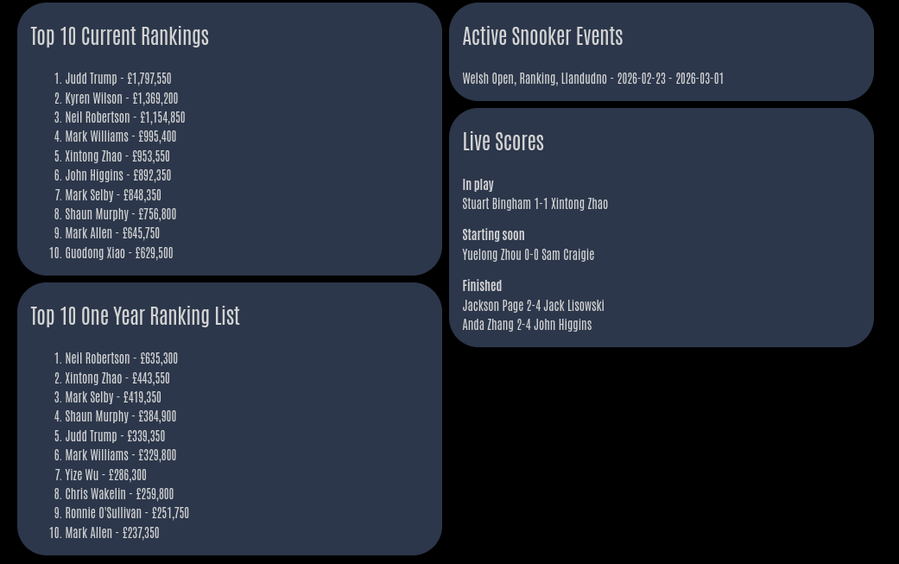
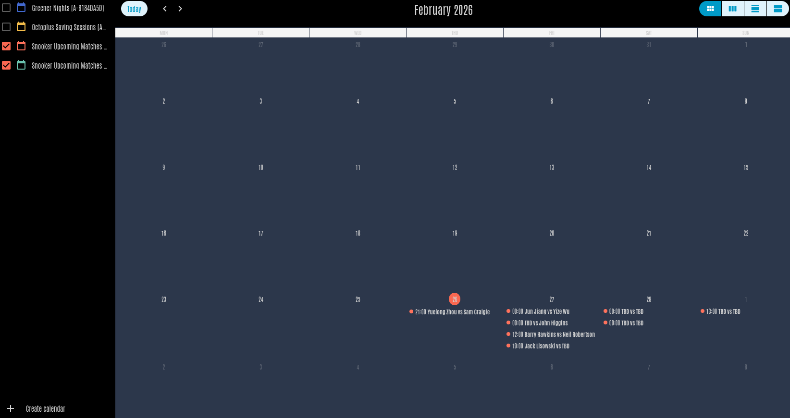
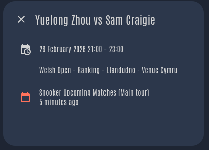

# Snooker Stats (Home Assistant Custom Integration)

This integration uses data from the [snooker.org API](https://api.snooker.org/).  
All match/event/ranking data is provided by snooker.org. This project only reads and presents that data in Home Assistant.

## Features

- Config flow (UI setup in Home Assistant)
- Tour filtering (`Main tour`, `Q Tour`, `Seniors`, `Women`)
- Optional calendar entity for upcoming matches
- Cached player-name lookup to resolve player IDs
- Automatic rate-limit handling (403 retries with backoff)
- Manual refresh services

## Requirements

- A valid `X-Requested-By` header value from snooker.org
- Request details: [https://api.snooker.org](https://api.snooker.org)

Without a valid header value, requests will fail.

## Installation

### Option 1: HACS

1. Open HACS in Home Assistant.
2. Add this repository as a **Custom repository** (type: **Integration**).
3. Search for **Snooker Stats** and install.
4. Restart Home Assistant.

### Option 2: Manual

1. Copy `custom_components/snooker_stats` into your Home Assistant `config/custom_components/` directory.
2. Restart Home Assistant.
3. Go to **Settings -> Devices & Services -> Add Integration**.
4. Search for **Snooker Stats** and complete setup.

## Configuration

During setup/options, configure:

- `X-Requested-By` header value (required)
- One or more tour types
- Whether to create the calendar entity

## Screenshots

### Integration Settings


### Dashboard Example



### Calendar (Month View)



### Calendar (Single Event Details)



## Important Startup Note (Player Cache)

On first setup, the integration builds a player cache (up to top players plus lookups).  
This can take time because requests are intentionally paced to avoid rate limits.

- Initial setup may not create entities immediately if cache bootstrap is still running.
- Once complete, entities are created automatically.
- Later refreshes mostly update/append to cache rather than recreating from scratch.

## Entities Created

- `sensor.snooker_current_season`  
  Current season information.

- `sensor.snooker_top_10_money_rankings`  
  Top 10 money rankings for the current season.

- `sensor.snooker_top_10_one_year_money_rankings`  
  Top 10 one-year money rankings.

- `sensor.snooker_upcoming_matches`  
  Upcoming matches (compact match payload).

- `sensor.snooker_events_in_season`  
  Events for the season (includes `ID`, `Name`, `City`, `Type`, `StartDate`, `EndDate`).

- `sensor.snooker_current_match_scores`  
  Current/near-live scores from API `t=17`, filtered by configured tours.

- `calendar.snooker_upcoming_matches` (optional)  
  Upcoming match calendar events.

## Services (Manual Refresh)

Available service calls:

- `snooker_stats.refresh_season`
- `snooker_stats.refresh_rankings`
- `snooker_stats.refresh_upcoming`
- `snooker_stats.refresh_events`
- `snooker_stats.refresh_scores`
- `snooker_stats.refresh_all`

Use these in **Developer Tools -> Services** when you want immediate updates.

## Example Lovelace Cards

Use **Manual Card** in dashboard edit mode and paste one of the examples below.

### Top 10 Money Rankings

```yaml
type: markdown
title: Top 10 Money Rankings
content: >
    No data yet.  

  {{ loop.index }}. {{ r.PlayerName }} - £{{ '{:,.0f}'.format((r.Sum or 0) |
  float) }}  
```

### Active Events (Today)

```yaml
type: markdown
title: Active Snooker Events
content: >
    
   No active events.   {{ e.Name }}, {{ e.Type }}, {{ e.City }} - {{ e.StartDate }} - {{ e.EndDate
  }}  
```

### Live Scores (In Play / Starting Soon / Finished)

```yaml
type: markdown
title: Snooker Live Scores
content: >
  

  

  

  

  **In play**

   No matches in play.   {{ m.Player1Name }} {{ m.Score1 }}-{{ m.Score2 }} {{ m.Player2Name
  }}

   

  **Starting soon**

   No matches starting soon.   {{ m.Player1Name }} {{ m.Score1 }}-{{ m.Score2 }} {{
  m.Player2Name }}

   

  **Finished**

   No finished matches.   {{ m.Player1Name }} {{ m.Score1 }}-{{ m.Score2 }} {{ m.Player2Name
  }}

   

```

## Rate Limits / API Behavior

- If the API returns `403`, requests are retried after a delay.
- Player-cache fetch logs include progress context to help identify where rate limiting occurs.

## Troubleshooting

- If entities are missing after first install, wait for initial cache bootstrap to complete and check logs.
- If requests fail, verify your `X-Requested-By` value with snooker.org.
- If data seems stale, run `snooker_stats.refresh_all`.
